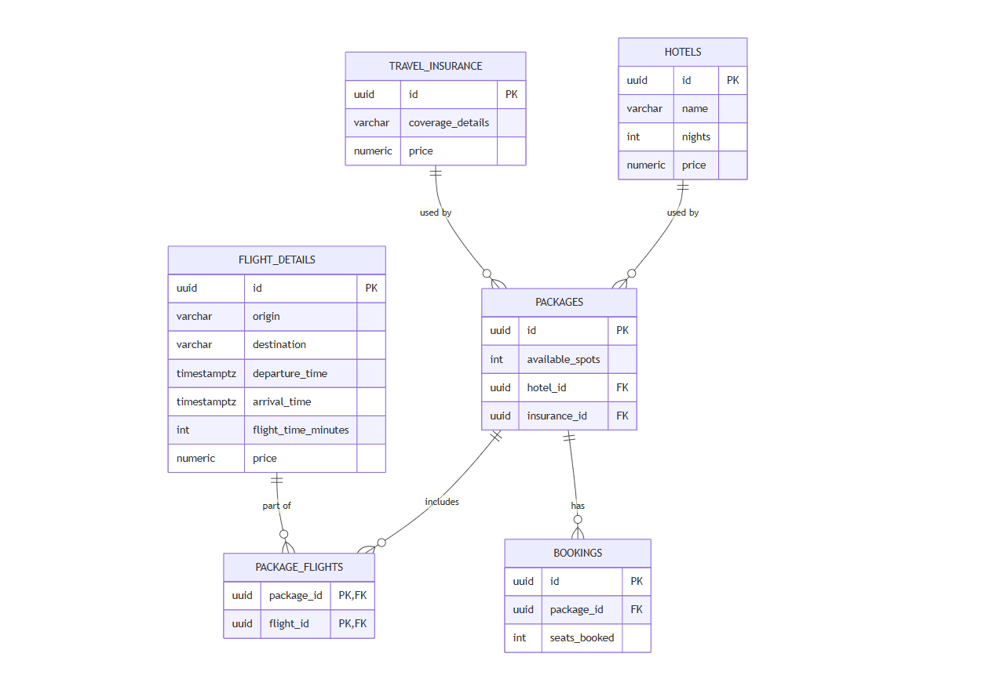

# Travel Package Booking System

Minimal travel package booking system: NestJS + PostgreSQL + Redis backend, Next.js frontend.

> Status: DB schema, seed, API endpoints, and all 3 frontend screens done, with e2e tests
> (API-level and real-browser UI) and the AI-first reflection below.

## Stack

- Backend: NestJS, plain SQL via `pg` (no ORM), PostgreSQL, Redis (ioredis)
- Frontend: Next.js (App Router), TypeScript, Tailwind CSS + SCSS for anything beyond
  Tailwind utilities, Zustand (booking flow state), SWR (client-side fetch caching)
- Infra: Docker Compose (Postgres, Redis, backend, frontend)
- E2E tests: Cypress, API-level and real-browser UI (`e2e/`)

## Running the project

1. Copy the env file and adjust if needed:
   ```bash
   cp .env.example .env
   ```
2. Start everything:
   ```bash
   docker compose up --build
   ```
3. Services:
   - Frontend: http://localhost:3000
   - Backend: http://localhost:3001
   - Postgres: localhost:5432
   - Redis: localhost:6379

The backend container runs migrations then seed data automatically on every start
(both are idempotent, safe to re-run).

## Data model

See `docs/erd.mmd`.



Plain SQL migrations, no ORM (`backend/src/migrations/*.sql`, run via
`backend/src/scripts/migrate.ts`). Seed data: `backend/src/seed/seed.sql`, run via
`backend/src/scripts/seed.ts`. To run either manually against a running stack:

```bash
docker compose exec backend npm run migrate:prod
docker compose exec backend npm run seed:prod
```

Package price is not stored: it's derived at query time as the sum of its flight legs'
prices plus its hotel and insurance prices.

To wipe accumulated demo bookings and restore original seed availability (repeated manual
testing/demoing consumes real inventory, same as a real booking system would):

```bash
docker compose exec backend npm run reset:prod
```

## API

- `GET /packages`: listing, served from Redis. Stale-while-revalidate: within the 15-min
  TTL the cached payload is served as-is; once stale, that same (stale) payload is still
  served immediately, and a background regeneration is kicked off for the *next* request
  (never blocks the current request on a rebuild). Response includes `generatedAt` and
  `stale` so the frontend can show a "last refreshed" indicator. A successful booking also
  triggers this same background regeneration right away, since real availability just
  changed and the listing shouldn't wait out the rest of its TTL to reflect that. Both paths
  share one Redis lock (`packages:listing:lock`, 30s) so concurrent triggers don't pile up
  duplicate rebuilds.
- `GET /packages/:id`: full detail (schedule, flights, hotel, insurance, live availability).
  Always reads Postgres directly, never cached.
- `POST /packages/:id/bookings`: body `{ "seats": number }`. Re-checks real availability in
  Postgres inside a `SELECT ... FOR UPDATE` transaction (never trusts the cache), decrements
  atomically, and inserts the booking. Race-safe: concurrent requests for the same package are
  serialized by the row lock, so overbooking is structurally impossible, not just checked for.
  - Success: `201` with `bookingId`, `bookingCode`, `seatsBooked`, `totalPrice`.
  - Insufficient availability: `409` with `{ error: "INSUFFICIENT_AVAILABILITY", requested, available }`.
  - Unknown package: `404`. Invalid `seats` (non-positive/missing): `400`.

## Frontend

Mobile-first, 3 screens (`frontend/src/app/`):

- `/`: package listing, consumes the cached `GET /packages`. Loading skeleton, empty/error
  states with retry, client-side search by city/airport. Each card shows route, dates,
  duration, stops, price, and an availability label (spot count, or "Unavailable" when
  `availableSpots < 1`).
- `/packages/[id]`: full detail, schedule, included items (flights/hotel/insurance) with
  individual prices, live availability, a guest stepper clamped to `[1, availableSpots]`
  (both buttons disable at their bound, amber warning when pinned at the availability
  ceiling), and a "Book" button that's disabled outright when sold out. Clicking "Book"
  submits the booking directly (button shows "Confirming…" and disables while in flight,
  guarded against a double-click firing two requests) and only navigates once the result is
  known, so the booking-maker page never has to trigger a mutation itself.
- `/packages/[id]/booking`: the booking-maker page. Reads the already-known result (package +
  seat count + outcome) from a Zustand store and renders success or error **on this same
  page**, no separate confirm step. Landing here without a matching result (direct link,
  refresh, back button) redirects back to the detail page. The error view shows requested
  vs. actually-available spots side by side and states plainly that no charge was made.

State: Zustand only for the cross-page booking flow (package id, seat count, submission
status/result/error). Presentational components are plain props in, callbacks out, no
store/fetch coupling inside them. Data fetching: SWR wrapping the two `GET` endpoints for
client-side caching/dedup (on top of, not instead of, the backend's own Redis cache).

## E2E tests

Cypress, two suites in `e2e/`, both against a live backend + Postgres + Redis (no mocking):

```bash
cd e2e
npm install
npm test      # API-level (cy.request), config: cypress.config.ts, default baseUrl :3001
npm run test:ui   # real browser against the Next.js app, config: cypress.ui.config.ts, default baseUrl :3000
```

API suite covers: listing shape/cache metadata, detail derivation (price = flights + hotel +
insurance), connecting-itinerary destination resolution, booking success + availability
decrement, overbooking rejection (sold-out package, and requested > available), input
validation, 404s.

UI suite drives the actual pages: listing render + availability labels, detail page content,
guest stepper bounds, sold-out state, and a full booking round-trip through the real UI for
both outcomes, including a genuine overbooking race (another booking is fired via the API
*between* the browser selecting seats and clicking "Book", so the error screen reflects a
real, not simulated, availability change).

Both suites mutate real data (bookings/availability), so package targets are resolved
dynamically via API calls rather than hardcoded, and any assertion needing an *exact* seat
count reads it from the live detail endpoint, not the cached listing. Run
`npm run reset` (or `reset:prod` in the container) in `backend/` to restore original seed
availability after testing.

## Project structure

```
.
├── backend/              # NestJS API
│   └── src/
│       ├── migrations/   # plain SQL, applied in filename order
│       ├── seed/          # seed.sql, reset.sql
│       ├── scripts/       # migrate.ts / seed.ts / reset.ts runners
│       ├── packages/      # controller / service / dto for the 3 endpoints
│       ├── redis/         # Redis client provider
│       └── database/      # pg Pool provider
├── frontend/             # Next.js app
│   └── src/
│       ├── app/            # 3 pages (listing, detail, booking-maker)
│       ├── components/     # prop-driven presentational components (+ ui/ primitives)
│       ├── store/          # bookingStore.ts (Zustand)
│       └── lib/            # api.ts, hooks.ts (SWR), types.ts, format.ts
├── e2e/                  # Cypress: API suite + real-browser UI suite
├── docs/                 # erd.mmd (source) + diagram.png (rendered ERD)
├── docker-compose.yml
├── .env.example
└── README.md
```

## AI-first reflection

**Tool & scope**: Claude Code, used across every part of the system: schema/migrations, seed
data, caching, availability validation, and the frontend. Done by giving it explicit
constraints up front (stack, patterns, tradeoffs to avoid) rather than open-ended requests,
and correcting its output where those constraints weren't specific enough.

**Key prompts**:
1. *Schema*: "I'm wondering if it's really worth having a bridge table for hotel and insurance
   like we did for flights, since a package only includes one of each. It's useful for
   `package_flights` because a package can have multiple flights (departures/connections/returns)."
2. *Caching*: "For the Redis cache revalidation, use a 15-minute TTL with regeneration on the
   next request. Serve the stale value on the request after the TTL expires; don't regenerate
   then serve, serve then regenerate."
3. *Availability*: "Create the three endpoints: list packages, package detail, and a booking
   POST with the number of seats requested. Handle overbooking errors, e.g. requesting 5 seats
   when fewer are available, with clear error states."

**What I changed/rejected**:
1. *Schema*: Claude's first schema draft mirrored the `package_flights` bridge table for
   hotels and insurance too, which would have meant `package_hotels` and `package_insurance`
   bridge tables. I rejected that: a package has exactly one hotel and one insurance, so a
   many-to-many bridge was unwarranted complexity; a direct FK on `packages` was the right
   fit. The `package_flights` bridge table stayed only for flights, where a package genuinely
   has multiple legs.
2. *Booking submission trigger*: Claude's first pass at the detail page fired the booking
   submission from a `useEffect` reacting to store state. I rejected that too: a
   user-initiated mutation like this belongs on a direct `onClick` handler, not an effect,
   since an effect reacting to state is the wrong trigger for something that should happen
   exactly once, exactly when the user clicks. `handleBook` in
   `frontend/src/app/packages/[id]/page.tsx` is the corrected version; the booking-maker
   page's own `useEffect` is left only to redirect when landing there without a result
   (direct link, refresh, back button), never to trigger a mutation itself.

**Autonomous decision**: I'd decide implementation details myself, the kind that change how
the code is written, not what the product does. When a successful booking needed to also
refresh the listing cache instead of waiting out the TTL, I reused the existing background
regeneration function (the same one already handling the stale-cache case) rather than writing
a second one. Same result, less code to maintain: not a decision worth pausing for. I'd only
stop and check in when a decision changes the data model or what users can actually do with
the product, like whether a package can include more than one hotel. That's not an
implementation detail, it's a decision about what the system is for.
